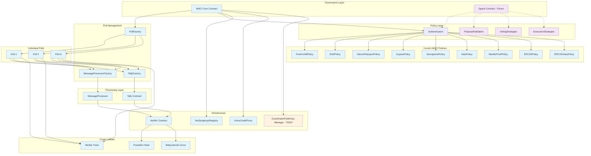
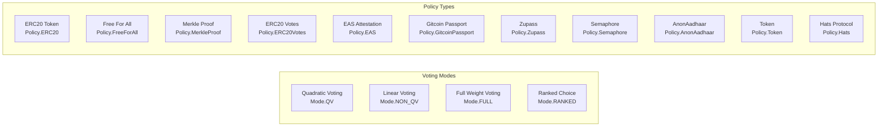
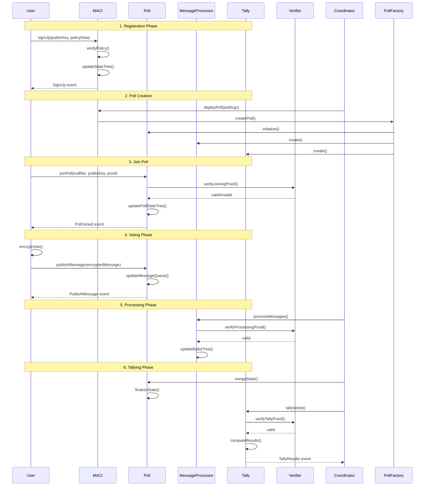
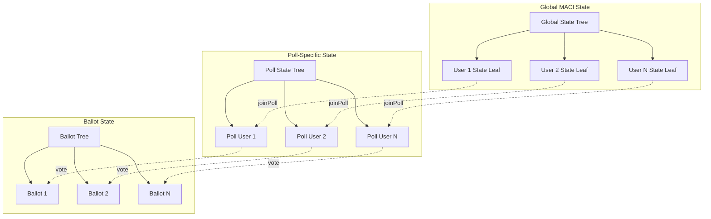
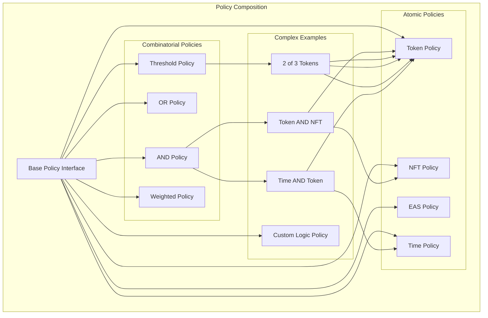
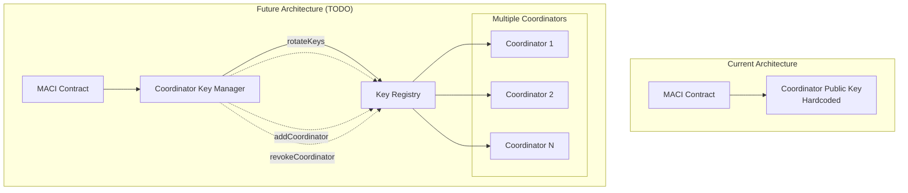
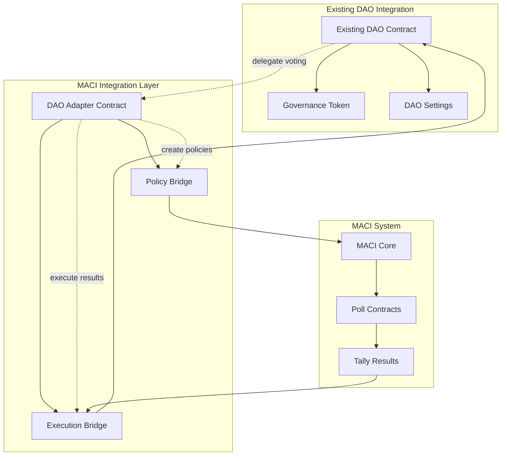
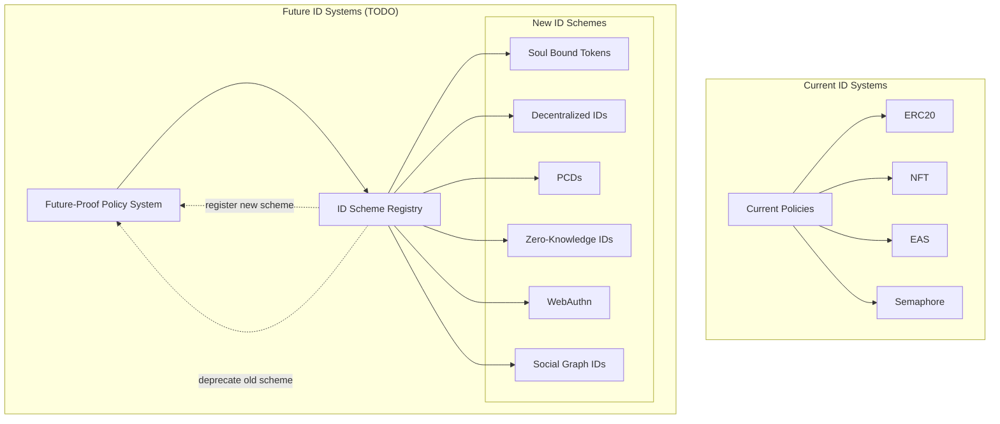

# MACI Governance Architecture Diagrams

## Overview

This document contains comprehensive diagrams and explanations of the MACI (Minimum Anti-Collusion Infrastructure) governance system, showing how contracts interact and the complete user journey from setup to execution.

## Contract Architecture Overview

The MACI system is a privacy-preserving governance mechanism that supports different governance systems through a modular architecture.

### Currently Implemented Contracts

**Core Contracts:**

- **MACI.sol**: The main contract that manages user signups, poll deployment, and maintains the global state tree. It serves as the central hub for all governance activities.
- **Poll.sol**: Individual poll contracts that handle encrypted message submission, poll joining, and vote processing. Each poll has its own state tree and voting period.
- **MessageProcessor.sol**: Processes encrypted messages and generates proofs for vote tallying.
- **Tally.sol**: Handles the final vote tallying and result computation using zero-knowledge proofs.

**Factory Contracts:**

- **PollFactory.sol**: Deploys new Poll contracts with proper initialization
- **MessageProcessorFactory.sol**: Creates MessageProcessor instances for polls
- **TallyFactory.sol**: Creates Tally instances for polls

**Policy Contracts (Authentication/Eligibility):**

- **FreeForAllPolicy**: Allows anyone to sign up and vote
- **EASPolicy**: Uses Ethereum Attestation Service for eligibility verification
- **GitcoinPassportPolicy**: Integrates with Gitcoin Passport for identity verification
- **ZupassPolicy**: Uses Zupass for authentication
- **SemaphorePolicy**: Integrates with Semaphore for anonymous authentication
- **HatsPolicy**: Uses Hats Protocol for role-based access
- **MerkleProofPolicy**: Uses Merkle proofs for allowlist-based access
- **ERC20VotesPolicy**: Token-based voting with snapshot support
- **ERC20Policy**: Simple token-based eligibility

**Supporting Contracts:**

- **VerifyingKeysRegistry.sol**: Manages zk-SNARK verifying keys
- **InitialVoiceCreditProxy contracts**: Determine voice credit allocation
- **Crypto utilities**: BabyJubJub, Poseidon hash functions, Verifier contracts
- **Tree implementations**: LeanIMT and LazyIMT for efficient Merkle trees

### Contracts That Need Implementation (Based on TODO)

**Missing Components:**

1. **CoordinatorPublicKeyManager**: A separate contract to hold coordinator public keys (mentioned in TODO - this would allow creating new DAOs without redeploying all MACI contracts)
2. **Advanced Policy Combiners**: Support for AND/OR logic between multiple policies (TODO mentions "poll requires a policy (we need to support and & or)")
3. **Payable Vote Functions**: Wrapper contracts to handle payable voting functions (TODO mentions "vote functions should be payable")
4. **Future ID Scheme Support**: Flexible identity verification system for future ID schemes

## Architecture Diagram



## User Journey Flow Diagram

```mermaid
graph TB
    %% User Actors
    User[User/Voter]
    Coordinator[Coordinator]
    Deployer[DAO Deployer]

    %% Setup Phase
    subgraph "1. Initial Setup"
        Deployer -->|Deploy MACI| MACI[MACI Core]
        Deployer -->|Configure Policies| PolicyFactories[Policy Factories]
        Deployer -->|Setup Infrastructure| VKR[VerifyingKeysRegistry]
        Deployer -->|Initialize| VCP[VoiceCreditProxy]
    end

    %% User Registration
    subgraph "2. User Registration"
        User -->|signUp()| MACI
        MACI -->|Check eligibility| SignUpPolicy[SignupPolicy]
        SignUpPolicy -->|Verify| ExternalSystems[ExternalSystems<br/>NFT/Token/EAS/etc]
        MACI -->|Update State Tree| StateTree[GlobalStateTree]
    end

    %% Poll Creation
    subgraph "3. Poll Creation (Proposal)"
        Coordinator -->|deployPoll()| MACI
        MACI -->|Create Poll| PollFac[PollFactory]
        PollFac -->|Deploy| Poll[Poll Contract]
        PollFac -->|Create| MsgProc[MessageProcessor]
        PollFac -->|Create| Tally[Tally Contract]
        Poll -->|Configure| PollPolicy[PollPolicy]
        Poll -->|Set Voice Credits| PollVCP[PollVoiceCreditProxy]
    end

    %% Poll Participation
    subgraph "4. Join Poll"
        User -->|joinPoll()| Poll
        Poll -->|Verify ZK Proof| Verifier[VerifierContract]
        Poll -->|Check Policy| PollPolicy
        Poll -->|Get Voice Credits| PollVCP
        Poll -->|Update Poll State| PollStateTree[PollStateTree]
    end

    %% Voting
    subgraph "5. Voting Process"
        User -->|Encrypt Vote| Client[ClientSide<br/>Encryption]
        User -->|publishMessage()| Poll
        Poll -->|Add to Message Queue| MessageQueue[MessageQueue]
        Relayer[Relayer] -->|relayMessagesBatch()| Poll
        Poll -->|Batch Processing| BatchHashes[BatchHashes]
    end

    %% Processing & Tallying
    subgraph "6. Message Processing"
        Coordinator -->|processMessages()| MsgProc
        MsgProc -->|Generate ZK Proof| Verifier
        MsgProc -->|Update Ballots| BallotTree[BallotTree]
        Poll -->|mergeState()| Poll
        Poll -->|Finalize State| FinalState[FinalPollState]
    end

    subgraph "7. Tallying"
        Coordinator -->|tallyVotes()| Tally
        Tally -->|Generate ZK Proof| Verifier
        Tally -->|Compute Results| Results[TallyResults]
        Poll -->|getPollResult()| Results
    end

    %% Execution
    subgraph "8. Proposal Execution"
        Coordinator -->|Verify Results| Results
        Coordinator -->|Execute Proposal| Execution[ExecutionStrategy<br/>/ DAOContract]
        Execution -->|Call Target Contracts| TargetContracts[TargetContracts]
    end

    %% Settings Management
    subgraph "9. Settings Management"
        Deployer -->|Update Policies| MACI
        MACI -->|Configure| PolicyFactories
        Coordinator -->|Update Poll Settings| Poll
        Poll -->|Modify Parameters| PollSettings[PollSettings]
    end

    %% Supporting Infrastructure
    subgraph "Infrastructure Layer"
        Crypto[CryptoUtilities<br/>Poseidon/BabyJubJub]
        Trees[MerkleTrees<br/>LeanIMT/LazyIMT]
        Storage[ContractStorage<br/>State/Ballots]
    end

    %% Connections to Infrastructure
    MACI --> Trees
    Poll --> Trees
    MsgProc --> Crypto
    Tally --> Crypto
    Verifier --> VKR
    StateTree --> Storage
    PollStateTree --> Storage
    BallotTree --> Storage

    %% Policy Connections
    PolicyFactories --> FFA[FreeForAll]
    PolicyFactories --> EAS[EASPolicy]
    PolicyFactories --> ERC20[ERC20Policy]
    PolicyFactories --> Gitcoin[GitcoinPassport]
    PolicyFactories --> Zupass[Zupass]
    PolicyFactories --> Hats[HatsProtocol]
    PolicyFactories --> Merkle[MerkleProof]

    %% Styling
    classDef user fill:#e3f2fd
    classDef contract fill:#f3e5f5
    classDef process fill:#e8f5e8
    classDef infrastructure fill:#fff3e0
    classDef policy fill:#fce4ec

    class User,Coordinator,Deployer user
    class MACI,Poll,MsgProc,Tally,Verifier,VKR,VCP,PollFac contract
    class SignUpPolicy,PollPolicy,PollVCP,Execution,TargetContracts process
    class Crypto,Trees,Storage,StateTree,PollStateTree,BallotTree,MessageQueue,BatchHashes infrastructure
    class FFA,EAS,ERC20,Gitcoin,Zupass,Hats,Merkle,PolicyFactories policy
```

## User Journey Breakdown

### Phase 1: Initial Setup

- **DAO Deployer** deploys the core MACI contract
- Configures policy factories for different authentication methods
- Sets up verifying keys registry and voice credit proxies

### Phase 2: User Registration

- **Users** register with MACI using `signUp()`
- Signup policy verifies eligibility (token holdings, NFT ownership, etc.)
- User's public key is added to the global state tree

### Phase 3: Poll Creation (Proposal)

- **Coordinator** creates new polls using `deployPoll()`
- Poll factory deploys Poll, MessageProcessor, and Tally contracts
- Configures poll-specific policies and voice credit allocation

### Phase 4: Join Poll

- **Users** join specific polls using `joinPoll()`
- Zero-knowledge proof proves eligibility without revealing identity
- Poll-specific state tree is updated

### Phase 5: Voting

- **Users** encrypt votes client-side using coordinator's public key
- Submit encrypted messages via `publishMessage()`
- **Relayers** can batch process messages for efficiency

### Phase 6: Message Processing

- **Coordinator** processes messages using `processMessages()`
- ZK proofs ensure valid message processing
- Updates ballot tree with encrypted votes

### Phase 7: Tallying

- **Coordinator** tallies votes using `tallyVotes()`
- ZK proofs enable private result computation
- Results are published on-chain

### Phase 8: Execution

- **Coordinator** verifies results and executes proposals
- Execution strategies handle contract interactions
- Target contracts implement the governance decisions

### Phase 9: Settings Management

- **Deployer** can update MACI-level policies
- **Coordinator** can modify poll-specific settings
- Dynamic configuration allows for governance evolution

## Key Features Demonstrated

**Privacy**: All votes are encrypted and processed using ZK proofs
**Modularity**: Different policies can be swapped without core changes
**Scalability**: Batch processing and efficient Merkle trees
**Flexibility**: Supports multiple authentication methods and voting strategies
**Integrity**: Cryptographic proofs ensure vote validity and result accuracy

## Voting Modes and Policy Types

The system supports multiple voting modes and policy types:



## Detailed Message Flow and State Management



## State Tree Architecture



## Future Enhancements (Based on TODO)

### Policy Composition Architecture

Based on the TODO mentioning "support and & or" policies, here's the planned architecture:



### Coordinator Key Management (TODO Item)



### Payable Voting Functions (TODO Item)

```mermaid
graph TB
    subgraph "Current Architecture"
        Poll[Poll Contract]
        VoteFunction[publishMessage()<br/>Non-payable]

        Poll --> VoteFunction
    end

    subgraph "Future Architecture (TODO)"
        Poll2[Poll Contract]
        VoteWrapper[Payable Vote Wrapper]
        PaymentProcessor[Payment Processor]
        Treasury[DAO Treasury]

        subgraph "Payment Logic"
            FeeStructure[Vote Fee Structure]
            RefundLogic[Refund Logic]
            IncentiveMechanism[Incentive Mechanism]
        end

        Poll2 --> VoteWrapper
        VoteWrapper --> PaymentProcessor
        PaymentProcessor --> Treasury
        PaymentProcessor --> FeeStructure
        PaymentProcessor --> RefundLogic
        PaymentProcessor --> IncentiveMechanism

        User[User] -->|payable vote| VoteWrapper
        VoteWrapper -.->|forward to| Poll2
        VoteWrapper -.->|process payment| PaymentProcessor
    end
```

### Integration with Existing DAOs



### Future ID Scheme Support (TODO Item)



## Key Takeaways for Future Development

1. **Policy Composition**: The system needs AND/OR policy combinators for complex eligibility rules
2. **Coordinator Management**: A separate key manager contract will enable multi-coordinator setups
3. **Payable Functions**: Vote wrappers can handle payment processing for vote fees or incentives
4. **DAO Integration**: Adapter contracts can bridge existing DAOs with MACI's privacy features
5. **Extensible ID System**: A registry-based approach allows adding new identity schemes without core changes

This architecture provides a solid foundation for building sophisticated, privacy-preserving governance systems that can evolve with the rapidly changing Web3 landscape.
